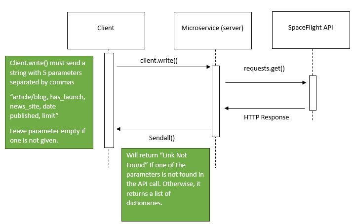

# SpaceFlight API Microservice

## How to Request Data

My microservice is setup to communicate through the use of sockets. In order to request data to my microservice you will need to create a socket that connects to port 65432 and IP address of 127.0.0.1. Start the server up by running the command:
```
python Server.py
``` 

Then you need to send the parameters that you want as one continous string separated by commas(Take notice that if a parameter is not given then leave it blank). Below you can see an example string and microservice call. I have written the examples in javascript.

```
Parameters (“article/blog, has_launch, news_site, date published, limit”)

Example String:
"Article, True,, 2023-11-15, 5"
```
```
Example Microservice Call:

var net = require('net');

var client = new net.Socket();
client.connect(65432, '127.0.0.1', function() {
    console.log('Connected');
    client.write('Article, True, Samsprint, 2023-11-15, 5');
});
```

## How to Recieve Data
As you can see below all that needs to be done is to write a function that listens for a response back from the microservice and then cut the connection once it recieves the data.

```
Example on how to recieve data:

client.on('data', function(data) {
    console.log('Received: ' + data.toString());  // Convert the received data to a string
    client.destroy(); // kill client after server's response
});
```

## UML Diagram

